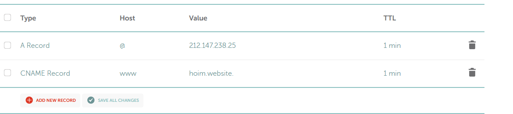
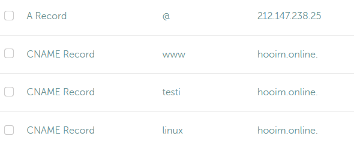
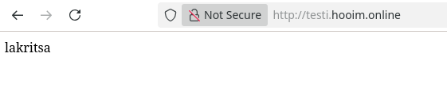
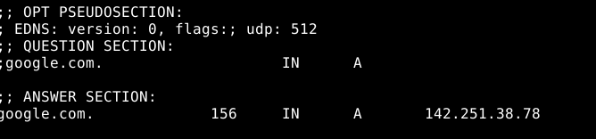
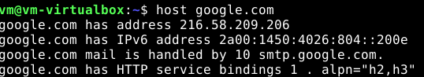

## DNS

Ostan uuden domain-nimen NameCheapista ja asetan Advanced DNS-osiosta A Record ja CNAME Record
 

A Record @ 212.147.238.25 kertoo mille IPv4-osoitteelle annetaan domain-nimi

CNAME Record www. hooim.online on alidomain, joka ohjaa päädomainiin eli hooim.online

## Alidomain 

Luon kaksi uutta alidomainia 

 

Ja testaan 

 

## Dig

Dig eli domain information groper on komento, joka hakee DNS-tietoa.

 
 
Kuvakaappauksesta näkyy haettavan nimi eli google, TTL on 156, IN = internet, A record eli IPv4-osoite. Dig komento näyttää enemmän tietoa, mutta keskityin vain nimipalvelusta tuleviin tietoihin.

Host toimii samoin tavoin kuin Dig, mutta se esittää tiedot yksinkertaisemmin

 

## Lähteet
A-tietue ja CNAME-tietue

https://www.namecheap.com/support/knowledgebase/article.aspx/579/2237/which-record-type-option-should-i-choose-for-the-information-im-about-to-enter/

Dig ja host

https://avenacloud.com/blog/using-dig-and-host-commands-for-dns-troubleshooting/
https://phoenixnap.com/kb/linux-dig-command-examples

