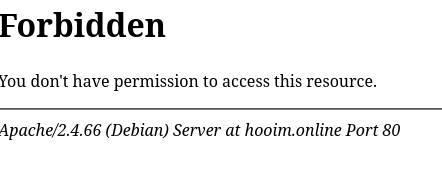
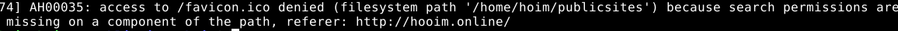
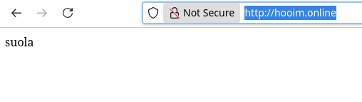
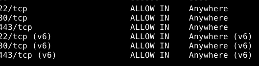
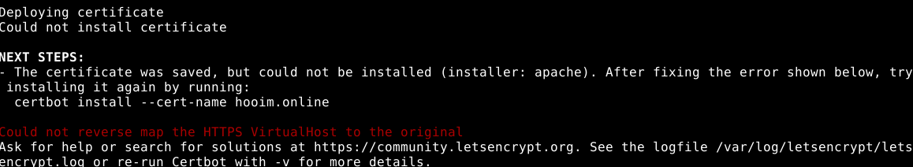

# Salaaminen

Tehtävänä on hommata verkkosivulle TSL-sertifikaatti, mutta ennen sitä, teen ensin uuden apache virtual host sivun

## Uusi Virtual Host

Luon uuden virtual host tiedoston 
```
cd /etc/apache2/sites-available/
micro kotisivu.conf

<VirtualHost *:80>
        ServerName hooim.online 
        ServerAlias www.hooim.online
        DocumentRoot /home/hoim/publicsites/hoim
        <Directory /home/reema/publicsites/hoim>
                Require all granted
        </Directory>
</VirtualHost>
```
Otan käyttöön ja käynnistän apachen uudelleen
```
sudo a2ensite kotisivu.conf
sudo systemctl restart apache2
```
Luon myös oikeat hakemistot

```
cd
mkdir -p publicsites/hoim
cd publicsites/hoim
micro index.html
```
Käyn tarkistamassa, jos sivu toimii.



Ei näköjään toimi, joten käyn katsomaan lokeja 

```
sudo tail /var/log/apache2/error.log
```
Lokeista näkyy, että puuttuu oikeudet hakemistoihin, joten korjataanpa se.



```
chmod ugo+x /home/hoim/
```
Nyt sivu toimii 



## Salaus

Nyt kun on toimiva sivu on aika hakea TSL-sertifikaatti

Avaan ensin portit 443 ja 80

```
sudo ufw status verbose
sudo ufw allow 80/tcp
sudo ufw allow 443/tcp
```


Päivitän ja asennan certbotin
```
sudo apt update
sudo apt install certbot
sudo apt install python3-certbot-apache
```
Haen sertifikaattia 
```
´sudo certbot --apache --domains hooim.online,www.hooim.online
```
Sertifikaatin hakeminen onnistui, mutta ei pystetty asentamaan. En ole varma mikä meni mättään.



## Lähteet

Tero Karvisen ohjeet ja tuntimateriaalit

https://terokarvinen.com/linux-palvelimet/#laksyt-ajallaan-ja-keskustelussa-mukana
