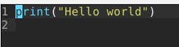
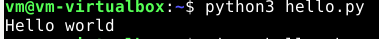
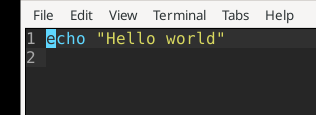
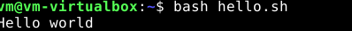
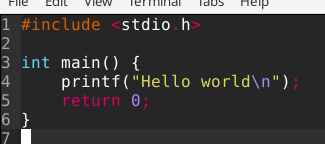
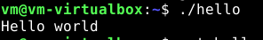
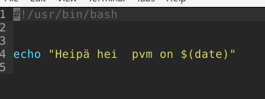
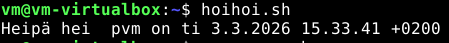

## Hello world

Hello world kolmella kielellä 

#### Python
```
micro hello.py
```

```
python3 hello.py
```


#### Bash
```
micro hello.sh
```

```
bash hello.sh
```


#### C

```
micro hello.c
```


```
gcc hello.c -o hello
./hello
```


## Uusi komento

Luon uuden komennon hoihoi.sh
```
micro hoihoi.sh
```


Teen niin, että kaikki voivat käyttää komentoa
```
sudo cp hoihoi.sh /usr/local/bin/
```


## Labraharjoitus

Yritän tehdä seuraavan labraharjoituksen Tero Karvisen sivusta: Arvioitava laboratorioharjoitus – Linux palvelimet ict4tn021-2 (uusi OPS) alkukeväällä 2017 p1

### Sivustot
Luon työntekijöille omat virtual host sivut esimerkkinä

```
cd /etc/apache2/sites-available/
micro sivu.conf

<VirtualHost *:80>
ServerName jorma.local
DocumentRoot /var/www/jorma
<Directory /var/www/jorma>
Require all granted
</Directory>
</VirtualHost>

sudo a2ensite sivu.conf
sudo systemctl restart apache2
```
ja luon oikeat polut
```
mkdir -p /var/www/jorma
echo Jorma |sudo tee /var/www/jorma/index.html
```
## Käyttäjäoikeudet

Maijallle luon sudo tunnukset

```
sudo adduser maija
sudo adduser maija sudo
```
## Palomuuri

Asennan palomuurin ja avaan portit 22 ja 80, kun halutaan olla etäyhteydessä

```
sudo apt-get install ufw
sudo ufw allow 22/tcp
sudo fw allow 80/tcp
``` 


### wowstat-komento
Teen uuden komennon nimellä wowstat, josta pitäisi näkyä tietokoneen tilasta

```
micro wowstat.sh
echo "$(uptime)"
```
Kopioin komennon kaikille käyttäjille 
```
sudo cp wowstat.sh /usr/local/bin/
```
Nyt wowstat-komennolla voidaan nähdä koneen tila

## Lähteet 

Tero Karvinen shell script

https://terokarvinen.com/2007/12/04/shell-scripting-4/

Tero Karvinen kielet

https://terokarvinen.com/2018/hello-python3-bash-c-c-go-lua-ruby-java-programming-languages-on-ubuntu-18-04/

Tero Karvinen labra

https://terokarvinen.com/2017/arvioitava-laboratorioharjoitus-linux-palvelimet-ict4tn021-2-uusi-ops-alkukevaalla-2017-p1/?fromSearch=arvioitava
