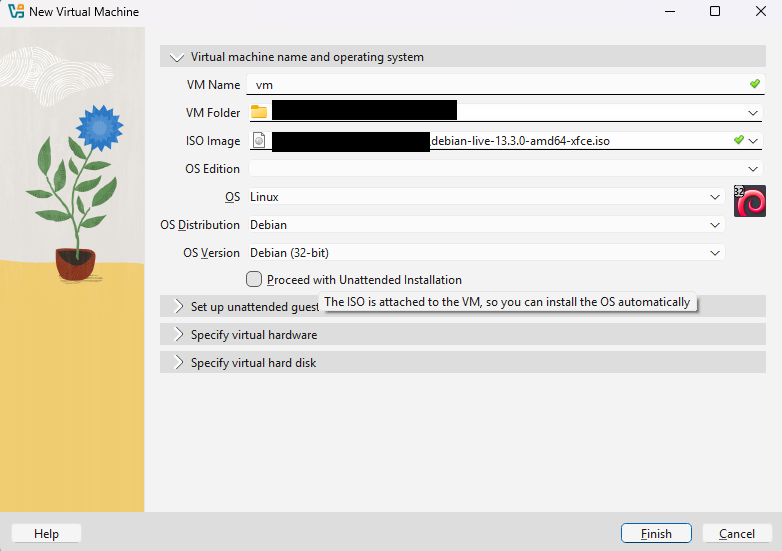
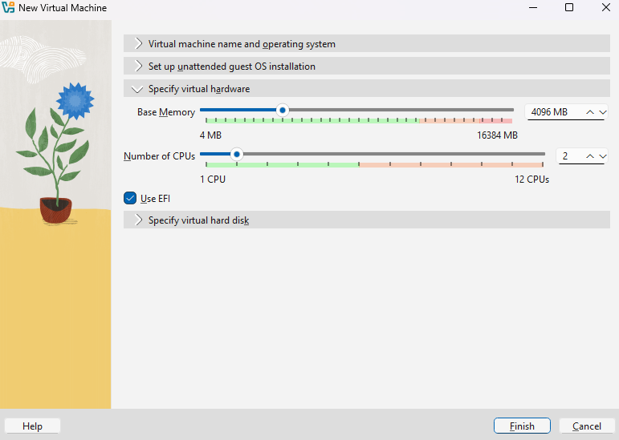
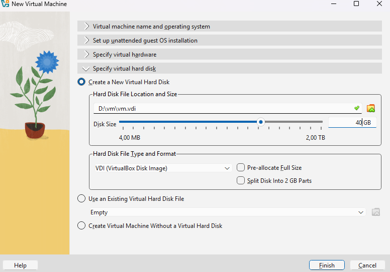
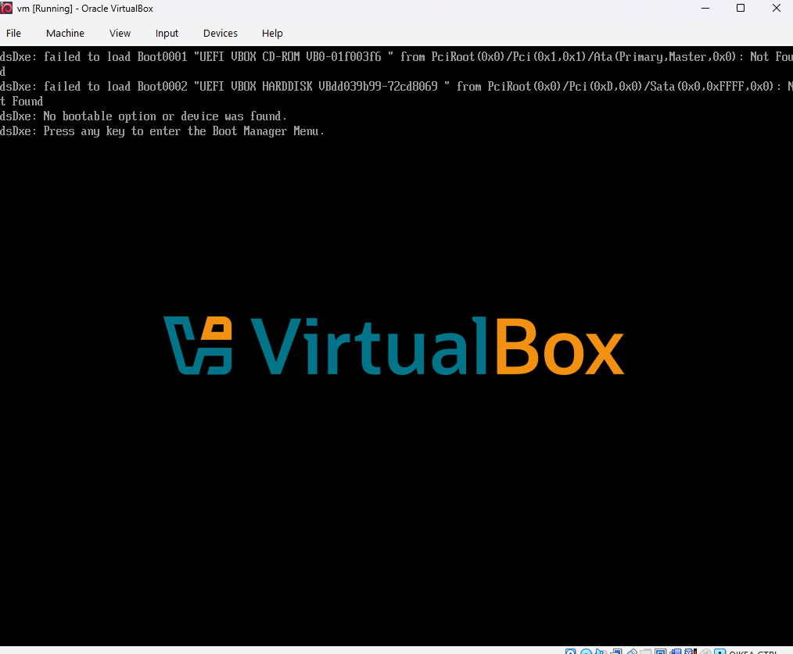
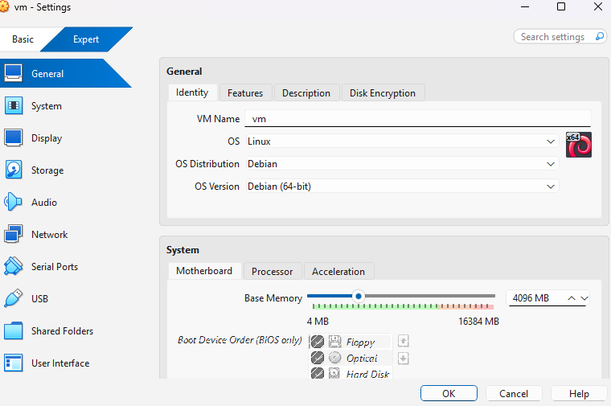
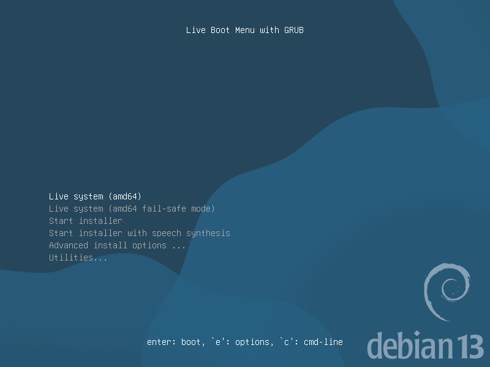
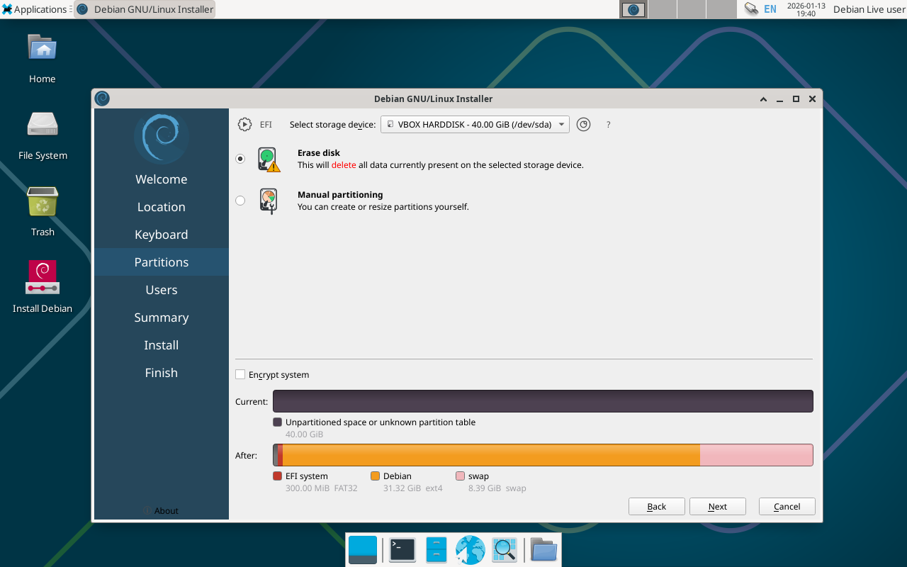
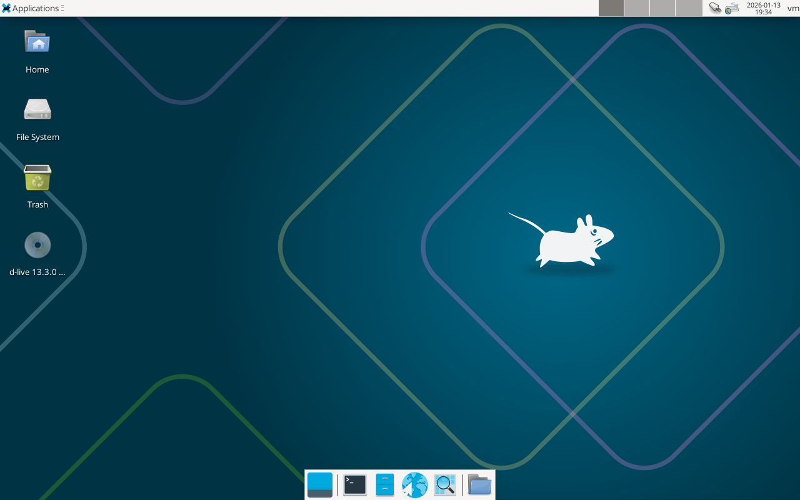

# x) Raportointi

- Raportoi samalla kun teet

- raportoi mahdollisimman tarkasti kaikki vaiheet, myös virheet

- tee helppolukuiseksi ja muista lähdevitteet

# a) Linuxin asentaminen virtualboxiin

- Lataan debian-live 13.3.0 version ja avaan virtualboxin. Omassa koneessani on windows käyttöjärjestelmä.

- Teen uuden virtuaalikoneen. Valitsen OS imageksi debian liven ja ruksaan pois "Proceed With Unattended Installation"

- Määritän koneelle virtuaalisen muistin ja prosessorien määrän sekä ruksaan "Use EFI"

- Määritän virtuaalisen kovalevyn koon

- Kun asetukset ovat valmiina käynnistän virtuaalikoneen

- Käynnistys epäonnistui 

- Asetusten tarkistamisen jälkeen, huomasin, että unohdin laittaa OS version 64-bitiksi

- Tällä kertaa onneksi käynnistyy. Bootataan live systeemillä

- Netti ja komentorivi toimivat moitteettomasti, joten siirryn debian asentamiseen.
- Käyttökielen, aikavyöhykkeen ja näppäimistön säätämisen jälkeen valitsen kovalevyn osioinnissa "Erase disk"

 

 - Kaikki asetukset näyttävät olevan kunnossa --> install
  
 - Kymmenisen minuutin jälkeen on käyttövalmis linux-pohjainen virtuaalikone!
   

## Viittaukset

Kurssi: ICI003AS2A-3016

Tehtävänannot: https://terokarvinen.com/linux-palvelimet/#schedule

Debian lataussivu: https://www.debian.org/distrib/

