# x.

## liikkuminen

-pwd: kertoo missä hakemistossa liikutaan

-ls: listaa kaikki tiedostot kyseisessä hakemistossa

-cd: käytetään kun halutaan siirtyä toiselle hakemistolle esim. $cd Music

 ## tiedostojen käsittely
 
nano: nano teksti editori
 
   mkdir: luo uuden hakemiston
 
 -rmdir: poistaa hakemiston
 
 -rm- poistaa tiedoston
 
 -cp -r: kopioi tiedoston tai hakemiston
 
 -mv oldname newname: hakemiston tai tiedoston nimen muuttaminen

 # b. APT
 Tehtävänä oli asentaa 3 uutta komentoriviohjelma, joten googlasin mitä ohjelmia netistä löytyisi.
 
 Päätin asentaa seuraavat ohjelmat sudo apt-get install-komennolla :

 ## Figlet
 
 Ohjelma muuttaa tekstin ascii kuvaksi

 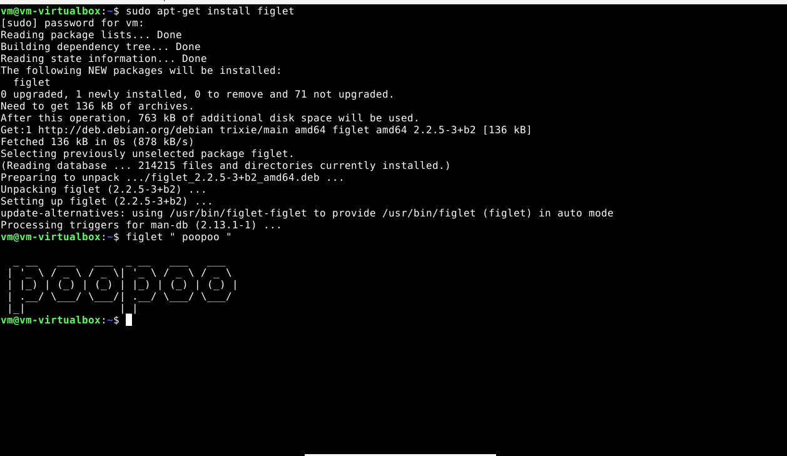

 ## Cowsay

 Cowsay muuttaa tekstin ascii lehmän tekstikuplaksi

 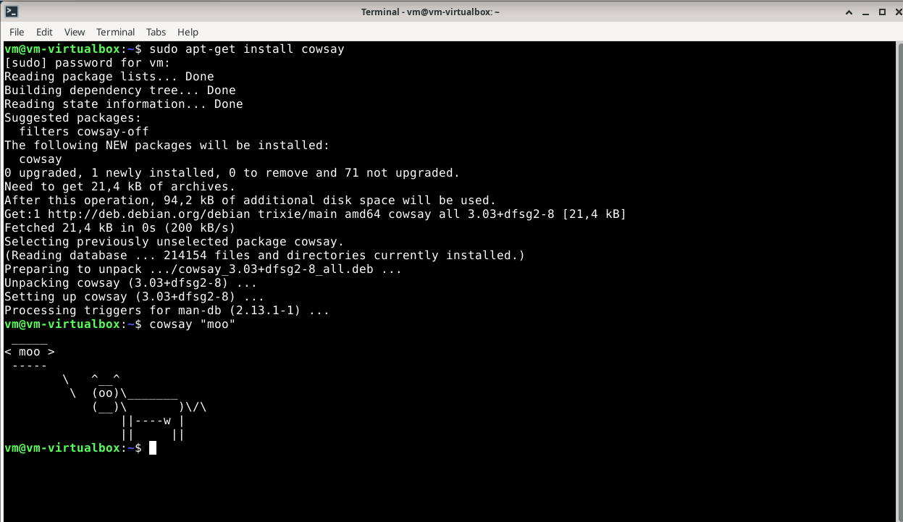

 ## Packman4console

 Perinteinen packman peli komentokehotteessa

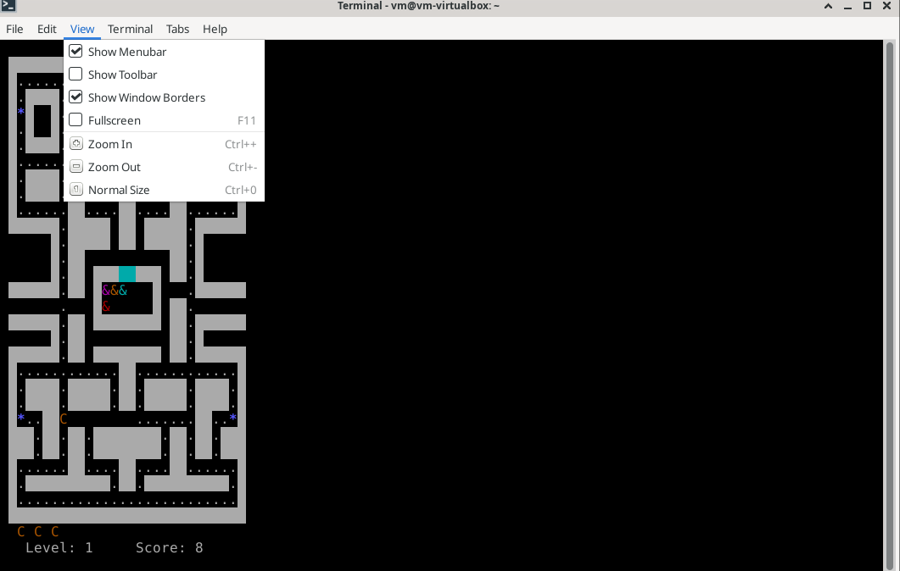

 # c. FHS
 ## home
 siirryn home hakemistoon komennolla cd /home ja näytän tiedostot ls-komennolla

 

 ## etc
 siirryn etc hakemistoon komennolla cd /etc ja näytän tiedostot ls-komennolla

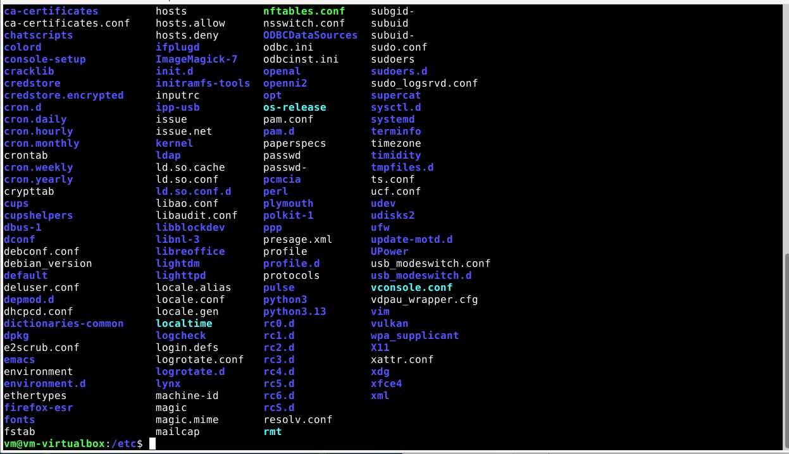

 ## media
 sama keisseli mutta cd /media komennolla

 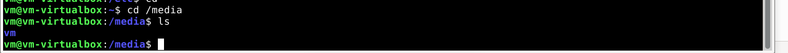

 ## var/logs
 sama juttu mutta cd /var/logs/ komennolla

 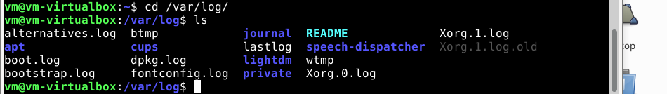

 
# d. grep

tässä tehtävässä käytän grep komentoa tekstitiedostossa

alla on tekstitiedostojen sisällöt

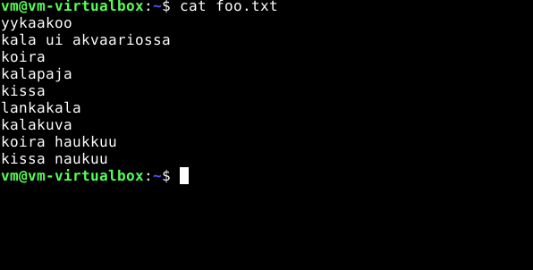

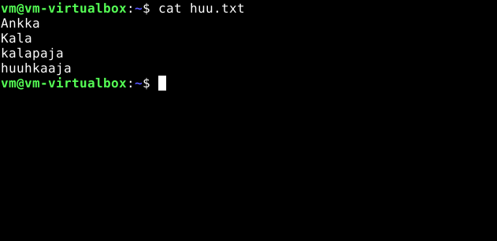

## grep

grep komennolla etsin tekstitiedostosta kaikki rivit, joissa sana "kala" esiintyy

## grep -e

 grep e- komennolla pystyn samaan aikaan etsimään tekstistä eri sanoja. Tällä kertaa etsin "kala" ja "kissa" sanoja

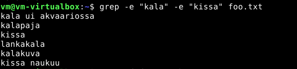

 
## grep -f

grep -f komenolla pystyn etsimään kahden eri tekstitiedostossa esiintyviä samoja sanoja tai merkkejä  

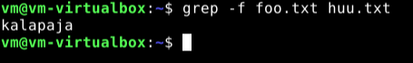

# e. pipe

pipe yhdistää eri komennot yhdeksi ja suorittaa ne vasemmasta oikealle. Tässä tehtävässä käytän komentoa cat foo.txt | head-4 | tail -2 tällöin terminaali käy foo.txt sisällön, valitsee siitä 4 ensimmästä riviä ja lopuksi listaa niistä neljästä 2 viimeistä riviä 

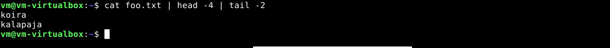

# f. rauta

asennan lshw komennolla sudo apt-get install lshw

komennolla sudo lshw -short- sanitize listaan virtuaalikoneen speksit

listasta näkyy virtuaalikoneelle asetetut tallennus ja muistin koot sekä isäntäkoneen prosessorin. 

 # lähteet
 linux kurssi
 
 https://terokarvinen.com/2020/command-line-basics-revisited/?fromSearch=command%20line%20basics%20revisited
 
 komentoriviohjelmia:
 
 https://medium.com/@gurpreet.singh_89/15-fun-linux-command-line-programs-to-spice-up-your-terminal-abf30af73de1
 
 grep ohjeet:
 
 https://manpages.debian.org/testing/grep/grep.1.en.html

 pipe ohjeet:

 https://www.geeksforgeeks.org/linux-unix/piping-in-unix-or-linux/
 
