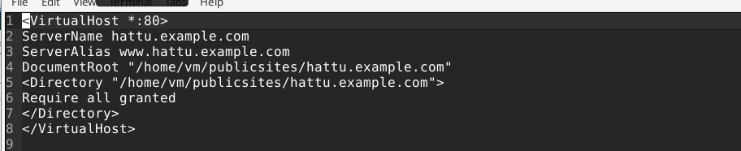
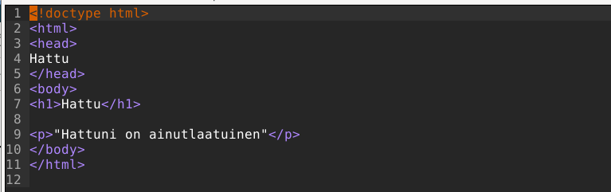
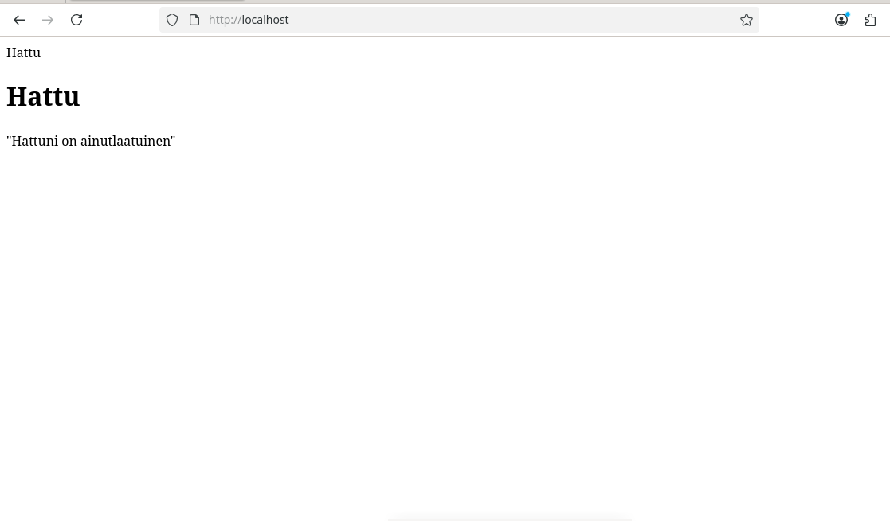
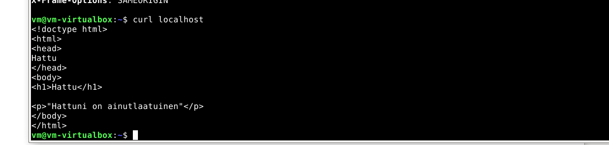
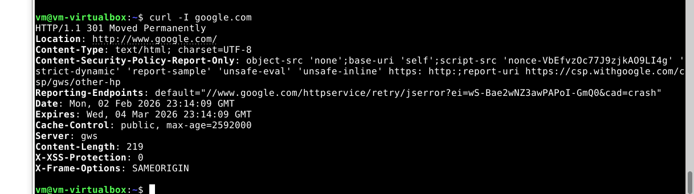

# H3 Hello web server

## Lokit

Avaan lokit menemällä hemistoon cd /var/log/apache2/ ja anna seuraavan komennon: tail -n 1 other_vhost_access-log. Tällä saan viimeisimmän lokin.

Nopean googlailun jälkeen huomaan, että:

- Punainen viiva kertoo käyttäjän IP-osoitteen
- Oranssi viiva kertoo milloin loki on luotu
- Punainen taas kertoo mitä haettiin
- Liila kertoo http-status koodit
- Sininen kertoo verkko-osoitteen
- Vihreä kertoo käyttäjän selaimen

## Uusi etusivu

Koska aiemmin oppitunnilla on jo luotu toimiva etusivu ja tarvittavat hakemistot tulen luomaan uuden etusivun nimellä hattu.example.com käyttäen näitä hakemistoja.

Käyn luomaan hattu.conf tiedoston seuraavassa hakemistossa /etc/apache2/sites-available. 

Conf tiedostoon kirjoitan mikrolla apachen konfiguraatiot. Annan servername ja serveralias nimeksi hattu.example.com ja hakemistopoluksi /home/vm/publicsites/hattu.example.com

Seuraavaksi luon uuden html tiedoston edellisen konfiguraation mukaisesti elikkä menen /home/vm/publicsites hakemistoon ja luon hattu.example.com ja sinne index.html

HTML tiedostoon teen mikrossa ohjeiden mukaisesti hattu-headerin

Nyt otan hattu.conf käyttöön sudo a2ensite hattu-komennolla ja käynnistän apachen uudelleen sudo systemctl restart apache2-komennolla

Viimeiseksi katson, jos kaikki toimii menemällä selaimessa http://localhost-osoitteeseen.

Onneksi vaikuttaa toimivan.

## Curl

Googlauksen jälkeen, opin, että curl-komento mahdollistaa datan lähettämisen järjestelmien välillä esim. verkko-osoitteiden avaaminen ilman selainta, kuten edellinen luotu kotisivu. 

curl -I-komento hakee http headerit esim. käyttäen komentoa curl -I google.com saadaan google-sivun headerit, joita ovat mm. palvelimen aika ja pvm, http-status koodit ja serveri

## Lähteet

  Tero Karvinen apache:https://terokarvinen.com/2018/04/10/name-based-virtual-hosts-on-apache-multiple-websites-to-single-ip-address/
  
  Tero karvinen html:https://terokarvinen.com/2012/short-html5-page/

  apache loki ohjeet: https://www.sumologic.com/blog/apache-access-log

  curl:https://www.geeksforgeeks.org/linux-unix/curl-command-in-linux-with-examples/
  
