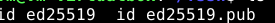
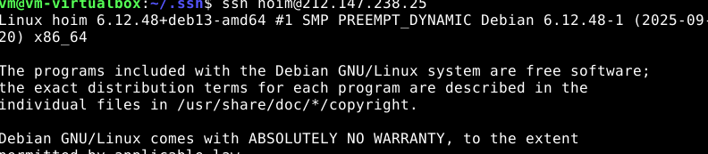
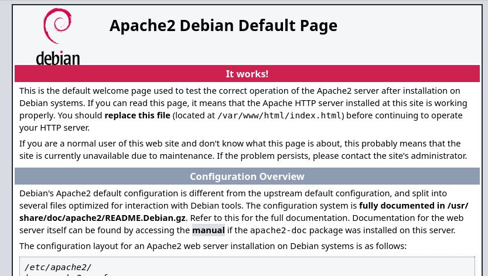
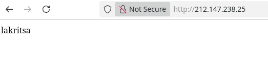

## SSH-avain

Tehtävää varten tarvitsen SSH-avaimen, joten luon semmoisen virtuaalikoneeseen antamalla komennon:

```
ssh-keygen
```
Tämä luo uuden ssh-avaimen, jonka saan siirtymällä .shh kansioon ja avaan sekä kopioin sieltä .pub päätteisen ssh-avaimen



## Uusi virtuaalipalvelin pilvipalvelu tarjoajalta

Nyt kun on ssh-avain, luon uuden serverin UpCloudiin ja syötän sinne ssh-avaimen, jotta etäyhteys voidaan luoda.

## Etäyhteys uuteen koneeseen

Nyt luon yhteyden UpCloudin koneeseen terminaalista root-tunnuksella

```
ssh root@212.147.238.160
```

Koska on uusi kone, niin haen ensin päivityksiä 

```
sudo apt-get update
```
Seuraavaksi asennan palomuurin 

```
sudo apt-get install ufw

```
ja teen sinne reiän 
```
sudo ufw allow 22/tcp
sudo ufw allow 80/tcp
```
ja Käynnistän palomuurin 

## Käyttäjä

Luon uuden käyttäjän.

```
sudo adduser hoim
```
Annan uudelle käyttäjälle oikeudet

```
sudo adduser hoim sudo
sudo adduser hoim adm
sudo adduser hoim admin
```
luon ssh asetukset

```
sudo cp -rvn /root/.ssh/ /home/hoim/
```
ja siirrän oikeudet hoim-käyttäjälle

```
sudo chown -R jurpo:jurpo /home/hoim/
```
Kokeilen seuraavaksi toisessa terminaalissa voinko luoda etäyhteyden hoim-käyttäjällä 

```
ssh hoim@212.147.238.160
```



Yhteys onnistui, joten teen päivitykset ja lukitsen root-tunnuksen

```
sudo usermod --lock root
sudo mv -nv /root/.ssh /root/DISABLED-ssh/
```

```
sudo apt-get update
sudo apt-get upgrade
sudo apt-get dist-upgrade
```
ja Teron suosittelemia paketteja 
```
sudo apt-get -y install micro bash-completion openssh-client wget curl
```
## Apache

Nyt kun kone on käyttövalmiina, niin asennan apachen 

```
sudo apt-get install apache2
```
Testaan menemällä selaimella ip-osoitteeseeni, josta näkyy apachen sivu


Korvaan sen antamalla komennon 

```
echo lakritsa |sudo tee /var/www/html/index.html
```



